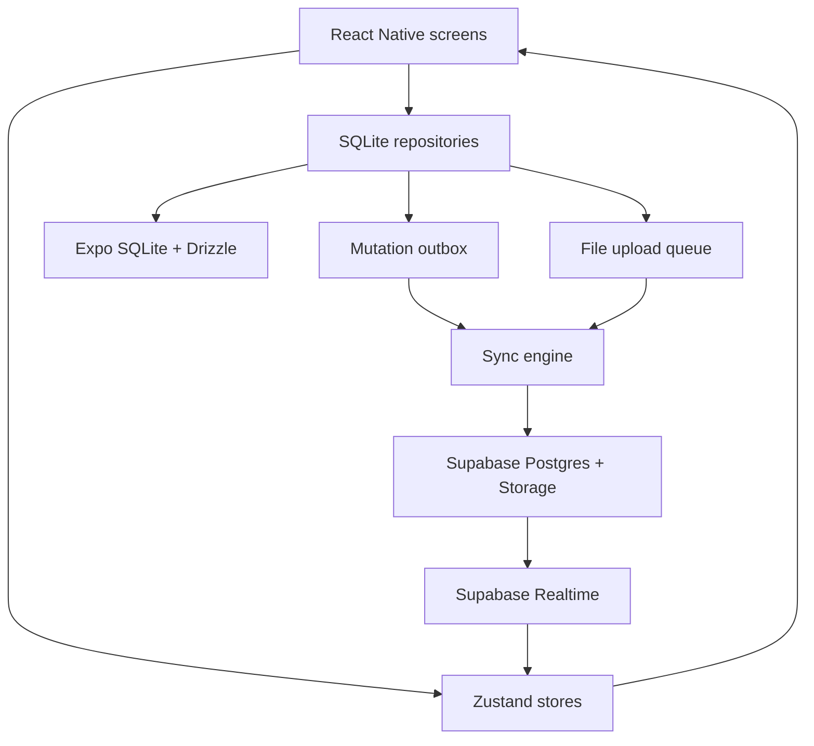
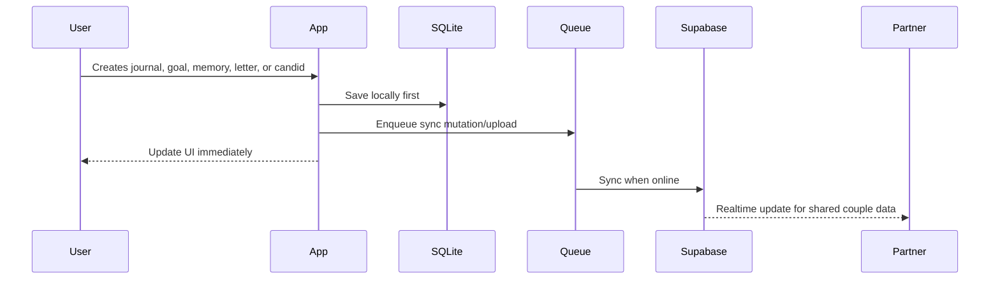

# Kami


**Your private emotional space for singles, couples, and everyone in between.**

Kami is a mobile app for private journaling, mood tracking, memories, future letters, personal goals, couple spaces, random candids, and shared relationship rituals. It is built for people who want a calmer place than chat apps and a more intentional home than a camera roll.

> Built by **Rohan Ray**. Status: active development, pre-launch.


## Why Kami

Most relationship apps are just messaging apps with softer colors. Kami is different: it is designed around emotional continuity.

- **For singles:** journal, track moods, write future letters, save memories, and grow privately.
- **For couples:** create a shared space with letters, goals, memories, candids, presence, and milestones.
- **Private by default:** solo content stays solo unless the user explicitly shares it.
- **Offline-first:** emotional moments should not depend on perfect internet.
- **Ritual-first:** Kami focuses on meaningful check-ins, not endless feeds.

## Product Snapshot

| Area | What Kami does |
| --- | --- |
| Solo Mode | Private journal, mood logs, future letters, memories, personal goals, streaks. |
| Couple Mode | Partner linking, shared memories, shared goals, couple letters, candids, realtime presence. |
| Offline-first | Writes to SQLite first, then syncs to Supabase through an outbox queue. |
| Realtime | Couple-scoped updates for partner activity, candids, letters, and shared data. |
| Security | Supabase Auth, SecureStore sessions, RLS policies, scoped storage buckets. |

## Feature Status

| Feature | Status | Notes |
| --- | --- | --- |
| Authentication | Implemented | Supabase Auth, email flows, Google Sign-In dependency, secure session handling. |
| Home dashboard | Implemented | Mood, prompt, streak, sync, personal/couple dashboard state. |
| Journal | Implemented | Personal and couple journal foundations. |
| Memories | Implemented | Timeline cards, image support, local-first data model. |
| Goals | Implemented | Personal and couple goals with progress tracking. |
| Future letters | Implemented | Drafts, delivery dates, read/favorite/archive states. |
| Couple system | Implemented | Couples, members, invitations, partner state. |
| Random candids | In progress | Candid wall, stack, viewer, first candid ceremony, streak schema. |
| Realtime presence | In progress | Couple listener and broadcast/action state exist. |
| Push notifications | In progress | Expo Notifications and FCM setup are present; server triggers need hardening. |
| AI features | Planned | Future relationship insights, suggestions, coaching. |
| Wearables/web | Planned | Roadmap items for later platform expansion. |

## Screens

| Screen | Purpose |
| --- | --- |
| Login / Sign Up | Account entry, verification, password recovery. |
| Home | Daily emotional dashboard and couple overview. |
| Journal | Personal and shared reflections. |
| Memories | Personal or couple memory timeline. |
| Goals | Progress tracking for self-growth or shared plans. |
| Future / Letters | Solo future letters or couple letters depending on active space. |
| Timeline | Relationship milestones and story events. |
| Settings | Profile, preferences, reminders, account controls. |

Add polished screenshots here as the UI stabilizes:

```text
assets/screenshots/
|-- login.png
|-- home.png
|-- journal.png
|-- memories.png
|-- goals.png
|-- letters.png
|-- candids.png
`-- settings.png
```

## Tech Stack

| Layer | Technology |
| --- | --- |
| Mobile | Expo SDK 54, React Native 0.81, React 19, TypeScript |
| Navigation | React Navigation native stack + bottom tabs |
| State | Zustand |
| Local database | Expo SQLite + Drizzle ORM |
| Backend | Supabase Auth, Postgres, Storage, Realtime |
| Auth/session | Supabase Auth, Google Sign-In, Expo SecureStore |
| Media | Expo Image Picker, Expo File System, Expo Image Manipulator |
| Notifications | Expo Notifications, Firebase Cloud Messaging |
| Build | EAS Build, EAS Submit, EAS Update |

## Architecture

Kami uses a local-first architecture: the app writes locally, updates the UI immediately, and syncs with Supabase when the network is available.



### Data Flow



## Repository Structure

```text
src/
|-- core/
|   |-- navigation/        # Root, auth, main tabs, deep links
|   `-- providers/         # App-level providers
|-- features/
|   |-- auth/              # Login, signup, auth store/hooks
|   |-- home/              # Dashboard and mood surfaces
|   |-- journal/           # Personal/couple journal UI
|   |-- memories/          # Memory timeline and modals
|   |-- goals/             # Goal cards and editors
|   |-- future/            # Future letters and couple letters
|   |-- couple/            # Couple store, realtime, candids
|   `-- settings/          # Profile and preferences
|-- infrastructure/        # Supabase/auth/couple/profile services
`-- shared/
    |-- db/                # Drizzle schema, repos, sync engine
    |-- ui/                # Reusable atoms, molecules, templates
    |-- hooks/             # Generic hooks
    |-- lib/               # Supabase, storage, auth helpers
    `-- constants/         # Design tokens
```

## Database

Kami has two persistence layers:

| Layer | Role |
| --- | --- |
| SQLite | Local source for fast offline reads/writes and pending sync queues. |
| Supabase Postgres | Cloud source for authenticated users, couple data, storage metadata, and realtime. |

Core local tables include:

- `profiles`
- `mood_logs`
- `journal_entries`
- `goals`
- `memories`
- `future_letters`
- `outbox_mutations`
- `file_upload_queue`
- `image_records`
- `couple_journals`
- `couple_memories`
- `couple_goals`
- `couple_letters`
- `couple_candids`
- `couple_candid_streaks`

Core Supabase tables include:

- `profiles`
- `mood_logs`
- `journal_entries`
- `goals`
- `memories`
- `future_letters`
- `couples`
- `couple_members`
- `couple_invitations`
- `couple_journals`
- `couple_memories`
- `couple_goals`
- `couple_letters`
- `relationship_events`
- `couple_candids`

For full schema details, see [master_supabase_setup.sql](./master_supabase_setup.sql) and [docs/README_DEEP_DIVE.md](./docs/README_DEEP_DIVE.md).

## Getting Started

### Prerequisites

- Node.js LTS
- npm
- Expo CLI / EAS CLI
- Android Studio or Xcode
- Supabase project
- Firebase project for push notifications
- Google OAuth credentials

### Install

```bash
npm install
```

### Run

```bash
npm start
npm run android
npm run ios
npm run web
```

For native modules such as Google Sign-In and notifications, use an Expo development build:

```bash
eas build --profile development --platform android
expo start --dev-client
```

## Environment

Expected environment values:

| Variable | Purpose |
| --- | --- |
| `EXPO_PUBLIC_SUPABASE_URL` | Supabase project URL |
| `EXPO_PUBLIC_SUPABASE_ANON_KEY` | Supabase anon key |
| `EXPO_PUBLIC_GOOGLE_WEB_CLIENT_ID` | Google OAuth web client |
| `EXPO_PUBLIC_GOOGLE_IOS_CLIENT_ID` | Google OAuth iOS client |
| `EXPO_PUBLIC_GOOGLE_ANDROID_CLIENT_ID` | Google OAuth Android client |
| `EXPO_PROJECT_ID` | Expo project id for push notifications |

Do not commit secrets. Client builds should only use public anon keys protected by Row Level Security.

## Build

```bash
eas build --profile preview --platform android
eas build --profile production --platform android
eas build --profile production --platform ios
eas update --branch production --message "Update message"
```

## Security Model

Kami is designed around privacy boundaries:

- Solo data is private by default.
- Couple data is scoped by couple membership.
- Supabase Row Level Security protects cloud tables.
- SecureStore is used for sensitive session material.
- AsyncStorage is reserved for non-sensitive preferences.
- Storage buckets are scoped by user id or couple id.

Known hardening work before launch:

- Add automated RLS tests.
- Add storage policy tests.
- Review local SQLite encryption options.
- Harden push notification server triggers.
- Verify realtime subscriptions under reconnect and couple switching.

## Roadmap

| Version | Focus |
| --- | --- |
| v1.0 | Auth, solo dashboard, journals, memories, goals, future letters, couple linking, candids, offline sync. |
| v1.5 | Better onboarding, candid streaks, reactions, relationship timeline polish, performance hardening. |
| v2.0 | Voice memories, relationship insights, shared calendar, anniversary reminders, optional encrypted backup. |
| v3.0 | Wearables, AI couple coach, web companion, third-party integrations. |

## Developer Notes

Read these first if you are contributing or using an AI coding agent:

- [docs/ARCHITECTURE.md](./docs/ARCHITECTURE.md)
- [docs/SUPABASE_SETUP.md](./docs/SUPABASE_SETUP.md)
- [docs/couples.md](./docs/couples.md)
- [docs/README_DEEP_DIVE.md](./docs/README_DEEP_DIVE.md)

Important rules:

- Screens should not call Supabase directly.
- Feature code belongs in `src/features/<feature>`.
- External I/O belongs in `src/infrastructure` or shared repositories.
- Durable user-created records should write to SQLite first.
- Never expose service-role keys in the mobile app.
- Never mix solo-private data into couple-shared records without explicit user action.

## Project Health

| Area | Current read |
| --- | --- |
| Architecture | Strong feature boundaries and offline-first foundation. |
| Tests | Needs dedicated test scripts and CI. |
| Security | Good RLS direction; needs automated verification. |
| Performance | Good stack; image/list/realtime paths need load testing. |
| Documentation | Root README is concise; deep docs live in `docs/`. |

## Author

**Rohan Ray**

- GitHub: `@WebRohanRay`
- Portfolio: `irohan.vercel.app`

## License

MIT
