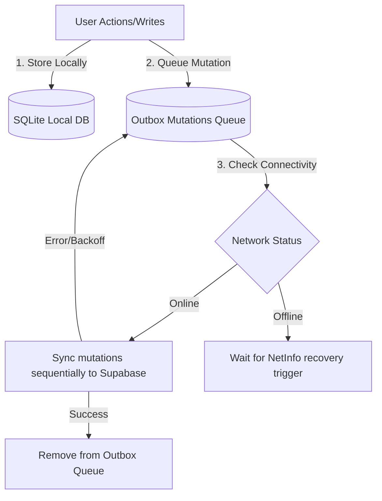

# ✦ KAMI — Private Relationship Sanctuary & Offline-First Journal

Kami is a premium, offline-first personal reflection and shared couple sanctuary built on **React Native (Expo)**, **SQLite (Drizzle ORM)**, and **Supabase**. It offers individuals and couples a private space to sync thoughts, capture memories, track goals, and send future-sealed letters, all with flawless offline-to-cloud synchronization, real-time presence indicators, and state-of-the-art security.

---

## 📖 Table of Contents
1. [Project Overview](#-project-overview)
2. [Key Product Features](#-key-product-features)
3. [Technology Stack](#-technology-stack)
4. [Architecture & Folder Structure](#-architecture--folder-structure)
5. [Under the Hood: How it Works](#-under-the-hood-how-it-works)
    - [Offline-First Sync Engine](#1-offline-first-sync-engine)
    - [Conflict Detection & Side-by-Side Resolution](#2-conflict-detection--side-by-side-resolution)
    - [Secure Couples Invitation Protocol](#3-secure-couples-invitation-protocol)
    - [Real-time Presence & Postgres CDC](#4-real-time-presence--postgres-cdc)
    - [Row-Level Security (RLS) Matrix](#5-row-level-security-rls-matrix)
6. [Getting Started & Local Development](#-getting-started--local-development)

---

## 🌟 Project Overview

Kami operates in two distinct workspaces:
*   **Personal Space (Single Mode)**: A private sanctuary for solo logging, emotion check-ins, personal goals, and mindfulness prompt notebooks.
*   **Couples Space (Shared Mode)**: A shared workspace linking two accounts. Features change into shared modules: collaborative journals, mutual goal gardens, interactive memory scrolls, and future-locked letter capsules.

Kami is designed with an **offline-first** architecture, ensuring that users can log moods, write entries, and upload images even in remote locations with zero network connectivity. All changes queue locally and synchronize securely to Supabase when a connection is restored.

---

## 🎨 Key Product Features

### 1. Home Dashboard & Love Clock
*   **Anniversary Counter**: Tracks the relationship duration down to the day, displayed on a glowing, animated card.
*   **Live Partner Presence**: Displays real-time partner actions (e.g., *"Partner is writing a letter..."*, *"Partner is online"*) using active ephemeral channel broadcasts.
*   **Daily reflection checks**: Prompts the user with a daily question. Answers remain locked under a blurred placeholder until both partners respond.

### 2. Offline-First Journal Feed & Calendar
*   **Feed & Grid Views**: Read journal entries chronologically or view a monthly calendar showing primary logged moods.
*   **Flexible Tags & Filters**: Filter by title/content search and tags.
*   **Image Attachments**: Write entries with multiple local pictures that upload asynchronously in the background.

### 3. Glowing Memories Vault
*   **Interactive Connected Timeline**: Renders memories along a custom, glowing vertical timeline.
*   **Netflix-Style Cards**: Scroll horizontally through shared moments with smooth parallax scaling.
*   **Location & Map Notes**: Store geolocations alongside photo cards.

### 4. Organic Milestone Goals (Garden Theme)
*   **Dynamic Visual Progression**: Goals evolve visually through three distinct growth phases:
    1.  **Sprouting Stage 🌱** (0% - 29% progress)
    2.  **Growing Stage 🌿** (30% - 99% progress)
    3.  **Full Bloom 🌸** (100% progress)
*   **Interactive Slider**: Update milestone indicators dynamically.

### 5. Wax-Sealed Future Letters
*   **Time Capsule Mechanics**: Write future-addressed letters with attachments and custom delivery dates.
*   **Wax Sealed Status 🔒**: Locked letters display a deep crimson wax seal insignia (`⚜️`) with an active countdown.
*   **Stationery Paper 📄**: Unlocking the letter reveals a customized lined stationery sheet with a soft texture.
*   **Server Privacy Verification**: The database structure restricts letter body reads via an RPC until the exact unlock time is reached.

---

## 🛠️ Technology Stack

| Layer | Technology | Key Purpose |
|---|---|---|
| **Core Framework** | React Native (Expo SDK 54) | Cross-platform native mobile experience |
| **Local Database** | Expo SQLite + Drizzle ORM | High-performance local SQL database persistence |
| **Cloud Database** | Supabase (PostgreSQL) | Secure backend database, Auth, & Storage |
| **State Management** | Zustand (v5) | Lightweight, performant client-side state storage |
| **Validation** | Zod | Strong schema verification at inputs & service boundaries |
| **Animations** | React Native Reanimated (v4) | Fluid UI transitions, pulsing badges, & scale gestures |
| **UI Components** | Shopify FlashList | Recycled list layouts for performance |

---

## 🏗️ Architecture & Folder Structure

Kami enforces a modular architecture separated into distinct boundaries:

```text
src/
├── app/
│   ├── providers/          # Root Context Wrappers (SafeArea, GestureHandler, Custom Themes)
│   └── navigation/         # Navigation Graph (Auth stack, Main Tab navigator, route types)
│
├── features/               # Isolated product domains. Cross-imports are strictly forbidden.
│   ├── auth/               # Signup, Login, Email Verification, Password Resets
│   ├── couple/             # Real-time state listeners, partner connections, calendars
│   ├── future/             # Sealed letters capsules, countdown timers
│   ├── goals/              # Garden-themed checklists, slider selectors
│   ├── home/               # Dashboard shells, quick stats panels, widgets
│   ├── journal/            # Grid calendar logs, tag arrays, entry cards
│   ├── memories/           # Netflix-style sliders, glowing timelines
│   └── settings/           # Profile details, space switching, grace-period deletions
│
├── shared/                 # Feature-agnostic common directory
│   ├── constants/          # Style tokens (Colors, Typography, Spacing, Shadows, Radii)
│   ├── hooks/              # Generic hooks (useTheme, useToggle, usePaginatedList)
│   ├── types/              # Common result types (Result<T>, AppError)
│   ├── lib/                # Third-party instance configs (Supabase client, Storage uploads)
│   └── ui/                 # Reusable atomic molecules (KamiButton, KamiText, Badges)
│
└── infrastructure/         # External IO. Feature layers NEVER query Supabase directly.
    ├── auth/               # authService (auth calls)
    └── profile/            # profileRepository (profile database tables)
```

---

## ⚙️ Under the Hood: How it Works

### 1. Offline-First Sync Engine
Kami operates offline by default, routing all write operations through local repositories and staging mutations:

*   **Media uploads** are queued in `file_upload_queue`. The files are compressed on-device, saved to the app directory, and uploaded asynchronously. Once uploaded, the local filepath is swapped with the remote signed URL.

### 2. Conflict Detection & Side-by-Side Resolution
When a mutation fails on the server due to a concurrent write, Kami flags the record with `sync_status = 'conflict'` and saves the server's version:
1.  **Badge Notification**: The UI renders a `Sync Conflict` badge over the card.
2.  **Interactive Resolution**: Clicking the card launches a side-by-side comparison panel displaying:
    *   *Local device edits* (timestamps, text contents, media count).
    *   *Cloud server data*.
3.  **Action**: The user can either **Keep Local Version** (re-queues local state as an override) or **Keep Cloud Version** (discards local edits and updates SQLite with server values).

### 3. Secure Couples Invitation Protocol
Invitation verification is protected against race conditions using a Postgres Remote Procedure Call (`accept_couple_invitation`):
*   **Atomic Transactions**: Locks the invitation record using `FOR UPDATE`.
*   **Safety Check**: Verifies that neither candidate is already connected to an active couple.
*   **Membership Insertion**: Inserts matching records in `couples` and `couple_members` simultaneously, switching the active spaces of both profiles to `'couple'`.

### 4. Real-time Presence & Postgres CDC
*   **Ephemeral Channels**: Ephemeral status updates (typing/reading) are broadcast over Supabase channels (`supabase.channel('presence:couple_id')`) and reflected as status indicators on the home screen.
*   **Postgres CDC Subscription**: Live database edits made by the partner (new comments, reactions, or entries) are streamed immediately via `supabase.channel('public:couple_journals')`, prompting local state updates.

### 5. Row-Level Security (RLS) Matrix
All tables are locked. Authenticated sessions query data through the `is_couple_member(couple_id)` helper function, ensuring users cannot view partner-only records without a valid membership:

| Database Table | RLS Policies Enabled | Access Constraint |
|---|---|---|
| `couples` | Yes | SELECT/UPDATE if user belongs to the couple |
| `couple_members` | Yes | SELECT if member of matching couple |
| `couple_journals` | Yes | CRUD restricted to members of `couple_id` |
| `couple_memories` | Yes | CRUD restricted to members of `couple_id` |
| `couple_goals` | Yes | CRUD restricted to members of `couple_id` |
| `couple_letters` | Yes | Body column hidden using secure RPC until `deliver_at` |

---

## 🚀 Getting Started & Local Development

### Prerequisites
*   Node.js (v18+)
*   Expo Go app on iOS/Android or an emulator

### 1. Installation
Clone the repository and install dependencies:
```bash
npm install
```

### 2. Configure Environment Variables
Create a `.env` file in the root directory:
```env
EXPO_PUBLIC_SUPABASE_URL=your_supabase_project_url
EXPO_PUBLIC_SUPABASE_ANON_KEY=your_supabase_anonymous_api_key
```

### 3. Run the Bundler
Start Expo's local bundler:
```bash
npm start
```
*   Press `a` to run on Android Emulator.
*   Press `i` to run on iOS Simulator.
*   Scan the QR code on a physical device using the Expo Go application.

### 4. Compile Check
To run TypeScript strict compilation checks:
```bash
npx tsc --noEmit
```
