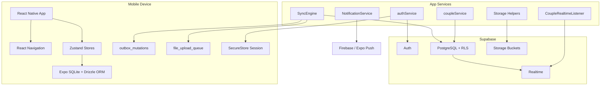
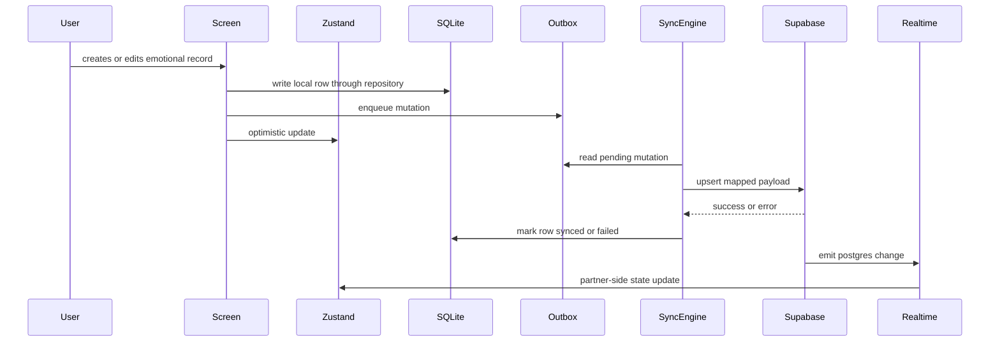
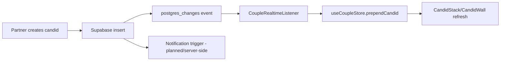
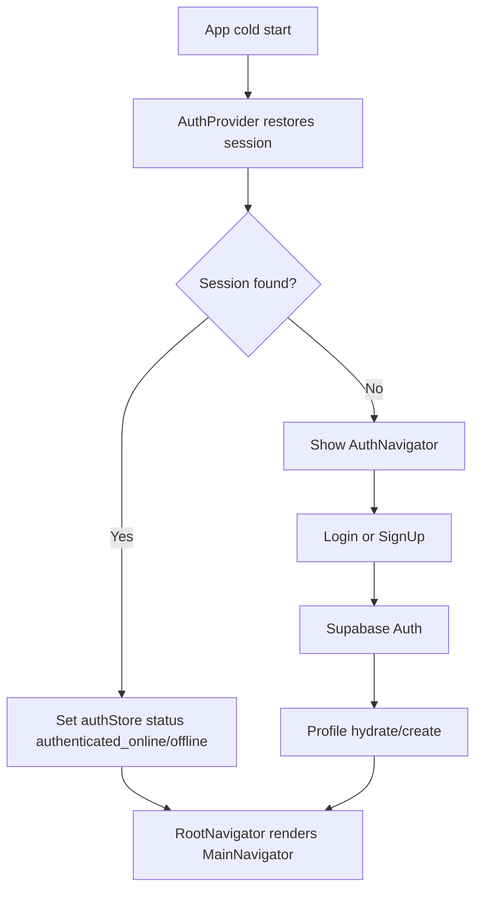
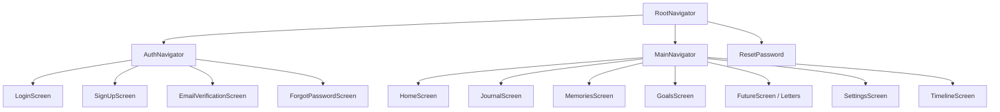

# Kami


Your private emotional space for singles, couples, and everyone in between.

Kami is a React Native mobile app by Rohan Ray that combines private journaling, memory keeping, future letters, personal goals, couple spaces, random candids, realtime partner presence, offline-first sync, and Supabase-backed security into one emotional operating system.

> Status: active development, pre-launch. This README documents the current repository and the intended product architecture. When the product vision is ahead of implementation, the section calls that out explicitly.

## 1. Header And Badges

| Field | Value |
| --- | --- |
| App | Kami |
| Tagline | Your private emotional space for singles, couples, and everyone in between. |
| Type | Expo React Native mobile app for Android and iOS |
| Current version | 1.0.0 |
| Author | Rohan Ray |
| GitHub | WebRohanRay |
| Portfolio | irohan.vercel.app |
| License | MIT |

Kami is designed as a calm, private, offline-capable emotional workspace. Solo users can journal, track moods, store memories, write letters to their future selves, and work on personal goals. Couples can layer a shared space on top of that private foundation through invitations, shared timelines, shared goals, letters, random candids, and realtime partner signals.

## 2. Executive Summary

Kami exists because most relationship products are messaging products wearing emotional clothing. WhatsApp, Telegram, Instagram, Snapchat, and ordinary chat apps are optimized for constant exchange, not reflection. They are fast, public-adjacent, notification-heavy, and built around streams that disappear into noise.

Kami is different. It is a private emotional operating system. It gives people a place to preserve what mattered, notice what they felt, send intentional letters, track relationship rituals, and keep a shared record without turning intimacy into another feed.

The product has two first-class modes:

| Mode | Who it serves | Core promise |
| --- | --- | --- |
| Solo Mode | Singles, people between relationships, people who want a private sanctuary | Your personal emotional life is worth preserving before, during, and after a relationship. |
| Couple Mode | New couples, long-distance couples, married couples, busy partners | Shared rituals can deepen connection without requiring constant chat. |

Core value proposition:

- Private by default: solo content remains personal unless explicitly shared.
- Offline-first: emotional capture should work when the network does not.
- Ritual-oriented: the product emphasizes memories, letters, goals, candids, streaks, and presence over infinite chat.
- Relationship-aware: Couple Mode is not a separate product; it overlays shared data on top of the solo foundation.
- Developer-friendly: the codebase separates features, shared UI, infrastructure services, SQLite persistence, Supabase sync, and navigation.

## 3. Product Philosophy

### Why Kami Exists

Kami treats emotions as durable data, not disposable content. A daily feeling, a private reflection, a tiny candid, or a letter to a future self can be more important than another message in a chat thread. The product asks: what if personal and relational growth had a quiet system of record?

### Design Principles

| Principle | Meaning | Product impact |
| --- | --- | --- |
| Emotion first | Features start from an emotional job, not a technical object. | Journals, memories, mood logs, letters, and couple rituals are core surfaces. |
| Private by default | Solo data is never treated as couple data. | Local-first personal records and explicit sharing boundaries. |
| Offline reliable | The app should capture the moment even without network access. | SQLite writes, outbox mutations, file upload queue, retry logic. |
| Meaning over volume | Kami is not trying to maximize message count. | No endless chat feed as the primary surface. |
| Rituals over reminders | Repeated small acts can build connection. | Streaks, daily prompts, future letters, first candid ceremony. |
| Calm but capable | The interface should feel soft without being fragile. | Feature-local screens, shared tokens, thoughtful loading and empty states. |

### Emotional Why By Feature Family

| Feature | Emotional reason | Functional shape |
| --- | --- | --- |
| Mood check-ins | Users often know they feel something before they can explain it. | Simple daily mood log with optional note and trend display. |
| Journal | Private reflection creates continuity in a changing life. | Local/remote synced entries with tags, mood, images, and pinned entries. |
| Memories | Important moments should not be trapped in camera rolls. | Timeline cards with date, title, body, image URLs, mood, and soft deletion. |
| Goals | Growth becomes easier when it is visible. | Personal and couple goals with progress, status, due dates, and archive states. |
| Future letters | Some feelings are meant to arrive later. | Sealed letters with delivery dates, draft/read/favorite/archive states. |
| Couple invitations | Pairing should feel intentional, not accidental. | Invite records, couple membership, active space switching. |
| Random candids | Everyday presence matters more than posed perfection. | Lightweight photo capture, candid wall, seen state, reactions, streaks. |
| Realtime presence | Knowing your partner is there can be comforting. | Couple-scoped Supabase channels, presence, broadcast actions, store updates. |

## 4. Screenshots

Screenshots should be added under `assets/screenshots/` as the UI stabilizes. The current repository includes app assets such as `assets/icon.png`, `assets/splash.png`, `assets/login.png`, Android adaptive icons, and notification icons.

| Screen | Image slot | What it does | Why it matters |
| --- | --- | --- | --- |
| Login | `assets/screenshots/login.png` | Email/password and Google sign-in entry. | Establishes trust before asking for personal data. |
| Sign Up | `assets/screenshots/signup.png` | Account creation and verification flow. | Creates the identity used by Supabase, SQLite mirrors, and couple linking. |
| Email Verification | `assets/screenshots/email-verification.png` | Guides users after registration. | Prevents silent confusion during auth setup. |
| Forgot Password | `assets/screenshots/forgot-password.png` | Starts password reset. | Keeps account recovery inside the app. |
| Reset Password | `assets/screenshots/reset-password.png` | Handles deep-linked password reset. | Completes recovery after the email link. |
| Home | `assets/screenshots/home.png` | Mood, prompts, streaks, dashboard widgets, couple overview. | Gives the user a daily emotional starting point. |
| Couple Space | `assets/screenshots/couple-space.png` | Partner state, shared modules, invitations, alerts. | Shows that Couple Mode is an added shared layer. |
| Random Candids | `assets/screenshots/random-candids.png` | Capture and view candid photos. | Turns ordinary presence into a small ritual. |
| Candid Wall | `assets/screenshots/candid-wall.png` | Stack and archive of shared candids. | Preserves unpolished moments. |
| Journal | `assets/screenshots/journal.png` | Personal or couple journal entries. | Keeps reflection central. |
| Future Letters | `assets/screenshots/future-letters.png` | Solo future letters or couple letters depending on active space. | Makes delayed emotional communication possible. |
| Memories | `assets/screenshots/memories.png` | Timeline and visual memory cards. | Turns photos and notes into a relationship archive. |
| Goals | `assets/screenshots/goals.png` | Personal or shared goal progress. | Makes growth observable. |
| Timeline | `assets/screenshots/timeline.png` | Relationship events and milestones. | Makes the shared story navigable. |
| Settings | `assets/screenshots/settings.png` | Preferences, reminders, theme, profile, auth controls. | Gives users agency over privacy and behavior. |

## 5. Feature Catalog

### Authentication

| Item | Details |
| --- | --- |
| Purpose | Create and restore a user session, then hydrate local profile state. |
| Current implementation | `src/features/auth`, `src/infrastructure/auth/authService.ts`, `src/shared/lib/auth/secureSessionStorage.ts`, Supabase Auth, Google Sign-In dependency, password reset screens. |
| User flow | Open app, restore session, show splash while `authStore.status` is `loading` or `restoring`, navigate to Main when authenticated, otherwise Auth. |
| Screens | `LoginScreen`, `SignUpScreen`, `EmailVerificationScreen`, `ForgotPasswordScreen`, `ResetPasswordScreen`. |
| Store | `useAuthStore` stores `user`, `status`, `error`, `gradientBg`. |
| SQLite | `profiles` mirrors user preferences, theme, push token, active space, mood, sync status. |
| Supabase | `auth.users`, `profiles`. |
| Offline behavior | Supports `authenticated_offline` status; local stores can remain available while sync waits. |
| Edge cases | Missing profile, restored session without network, reset password deep links, logout resets stores. |
| Risks | README prompt asked for Expo Router and PKCE-only flow; the current repo uses React Navigation and Supabase Auth services. Google OAuth must be verified in native builds. |

### Couple System

| Item | Details |
| --- | --- |
| Purpose | Let two authenticated users create a private shared layer without exposing solo content. |
| Current implementation | `src/infrastructure/couple/coupleService.ts`, `src/features/couple/store/coupleStore.ts`, Supabase tables `couples`, `couple_members`, `couple_invitations`. |
| User flow | User creates or receives an invitation, the service validates membership, Supabase creates couple membership, `active_space` can switch between personal and couple. |
| Screens | Home, Settings, Timeline, feature screens in couple active space. |
| Store | `couple`, `partner`, sent/received invitations, loading/error state. |
| SQLite | Couple content tables mirror shared data, including `couple_journals`, `couple_memories`, `couple_goals`, `couple_letters`, `couple_candids`. |
| Supabase | Couple tables use `public.is_couple_member(couple_id)` in RLS. |
| Realtime | Couple realtime listener subscribes after authentication. |
| Offline behavior | Existing couple data remains readable; new shared writes can queue through outbox for supported entity types. |
| Edge cases | Expired invitations, dissolved couples, inactive membership, partner profile missing, user not a member of requested couple. |

### Home

| Item | Details |
| --- | --- |
| Purpose | Daily dashboard for emotional state, streaks, prompts, goals, memories, partner state, and sync visibility. |
| Current implementation | `src/features/home/screens/HomeScreen.tsx`, `useHome`, `useHomeDashboard`, `homeService`, `memoryService`, `futureService`. |
| Components | `HomeHeader`, `PersonalDashboard`, `CoupleDashboard`, `MoodModal`, `CustomMoodModal`, `Tap`. |
| Store | `useHomeStore` stores mood logs, journal preview, goals, prompts, streaks, sync state. |
| SQLite | `mood_logs`, `journal_entries`, `goals`, `daily_prompts`, `prompt_responses`, `streaks`. |
| Supabase | Same personal tables plus profile state. |
| Offline behavior | Local dashboard renders from SQLite; pending count is computed from outbox and upload queues. |
| Edge cases | First day with no mood, no prompt answer, no goals, stale sync, active space switching. |

### Random Candids

| Item | Details |
| --- | --- |
| Purpose | Give couples a low-friction visual ritual that feels less performative than social media. |
| Current implementation | `src/features/couple/components/candid`, `src/features/couple/services/candidService.ts`, `couple_candids`, `couple_candid_streaks`. |
| User flow | Capture image, write local candid row, upload to `couple_candid_images`, insert Supabase row, partner receives realtime update, seen/reaction state updates. |
| Components | `CandidSendButton`, `CandidStack`, `CandidWall`, `CandidViewer`, `CandidEmptyOutline`, `FirstCandidCeremony`. |
| Store | `candids`, `unseenCandidCount`, `candidStreak`, `showFirstCandidCeremony`. |
| SQLite | `couple_candids`, `couple_candid_streaks`, `file_upload_queue`, `image_records`. |
| Supabase | `couple_candids`, `couple_candid_streaks`, storage bucket `couple_candid_images`. |
| Realtime | Couple-scoped postgres changes and broadcast events. |
| Offline behavior | Local images can be retained and uploaded later where queue paths are wired. |
| Edge cases | First candid ceremony, deleted candid, sender should not count as unseen, failed upload, missing image path, signed URL expiry. |

### Letters And Future Letters

| Item | Details |
| --- | --- |
| Purpose | Support intentional writing, delayed delivery, drafts, favorites, and archives. |
| Current implementation | `src/features/future`, local `future_letters`, shared `couple_letters`. |
| User flow | Compose in `WriteModal`, save draft or set delivery date, list in `FutureScreen`, read in `ReadModal`, favorite/archive/read states update. |
| Screens | `FutureScreen`, modal components. |
| Store | Personal future letters are loaded through home/future services; couple letters are in `coupleStore`. |
| SQLite | `future_letters`, `couple_letters`, `file_upload_queue`, `image_records`. |
| Supabase | `future_letters`, `couple_letters`, `couple_letter_reactions`, letter image buckets. |
| Offline behavior | Drafts and edits can be local first; sync later through outbox for supported operations. |
| Edge cases | Deliver date in future, read state, draft vs sealed, archived records, partner access to couple letters only. |

### Memories

| Item | Details |
| --- | --- |
| Purpose | Preserve personal and shared memory as a timeline, not just loose images. |
| Current implementation | `src/features/memories`, `memoryRepo`, `coupleMemoryRepo`, Supabase `memories`, `couple_memories`. |
| Components | `MemoryCard`, `MemoryTimelineCard`, `MemoryPreviewModal`, `MemoryNetflixCard`, `MemoryModal`, visual wrappers. |
| SQLite | `memories`, `couple_memories`, `image_records`, upload queue. |
| Supabase | `memories`, `couple_memories`, `couple_memory_reactions`, memory image buckets. |
| Offline behavior | Local creation and update first, then remote upsert. |
| Edge cases | No photos, multiple images, soft delete, image upload failure, local path vs storage path resolution. |

### Goals

| Item | Details |
| --- | --- |
| Purpose | Turn growth into a visible, revisitable commitment. |
| Current implementation | `src/features/goals`, `goals`, `couple_goals`. |
| Components | `GoalCard`, `GoalModal`, `GoalPreviewModal`. |
| Store | `homeStore.goals` for personal dashboard, `coupleStore.coupleGoals` for shared goals. |
| SQLite | `goals`, `couple_goals`. |
| Supabase | `goals`, `couple_goals`, `couple_goal_reactions`. |
| Offline behavior | Progress changes and creates queue through outbox where repository actions use `enqueueMutation`. |
| Edge cases | Progress bounds 0 to 100, completed state, target date, archived/deleted records. |

### Realtime Presence And Broadcast

| Item | Details |
| --- | --- |
| Purpose | Let partners feel lightweight presence without creating a chat product. |
| Current implementation | `CoupleRealtimeListener`, `broadcastService`, `coupleStore.partnerAction`, `myActiveAction`, `realtimeChannel`. |
| Events | Partner writing, editing, viewing, sending love, answering question, data changes. |
| Offline behavior | Realtime layer disconnects gracefully; SQLite remains source for local display. |
| Edge cases | Reconnect, duplicate payloads, stale channel after logout, user switching couple. |

### Push Notifications

| Item | Details |
| --- | --- |
| Purpose | Notify users of meaningful partner activity without turning Kami into an attention trap. |
| Current implementation | `src/infrastructure/notifications/notificationService.ts`, Expo Notifications, Firebase `google-services.json`. |
| Token storage | `profiles.push_token` locally and `profiles.push_token` remotely. |
| Notification types | Planned and partially wired: candid received, letter received, reaction received, partner online, reminders. |
| Deep links | `src/core/navigation/useDeepLink.ts` handles app links and reset routes. |
| Risks | Server-side trigger/Edge Function delivery should be hardened before launch. |

### Offline Sync

| Item | Details |
| --- | --- |
| Purpose | Make every emotional capture resilient to network instability. |
| Current implementation | `src/shared/db/sync.ts`, `outbox_mutations`, `file_upload_queue`, `image_records`. |
| Strategy | Write local record, enqueue mutation, upload files, map camelCase to snake_case, upsert to Supabase, update local sync status. |
| Retry | `MAX_RETRIES = 5`, `retryCount`, `nextRetryAt`, `lastError`. |
| Conflict | Server entity fetch, local previous/current wrapper, server updated timestamp, conflict modal path. |
| Edge cases | Delete discards queued uploads, stale local file path, timeout, invalid UUID, offline network state. |

### Security Layer

| Item | Details |
| --- | --- |
| Purpose | Keep personal and couple data scoped to rightful users. |
| Current implementation | Supabase RLS in `master_supabase_setup.sql`, SecureStore for sessions, storage object policies, service-role-only couple inserts. |
| Key rule | Personal rows use `auth.uid() = user_id`; couple rows use `public.is_couple_member(couple_id)`. |
| Risks | Local SQLite is not encrypted by default; optional encrypted backup is future work. |

## 6. Architecture

### System Architecture



### Write Path



### Realtime Flow



### Auth Flow



### Navigation Tree



### Why The Major Technologies Were Chosen

| Technology | Why it fits Kami | Trade-off |
| --- | --- | --- |
| Expo SDK 54 | Fast mobile iteration, dev client, native modules, OTA update path. | Native config still needs careful EAS and platform testing. |
| React Native 0.81 | Shared UI code for Android and iOS. | Performance requires discipline around lists, images, and renders. |
| TypeScript | Emotional data needs reliable contracts across local and remote stores. | Strict typing adds upfront work. |
| React Navigation | Mature stack/tab model currently used by the repo. | Prompt described Expo Router, but repo does not use it. |
| Zustand | Small, direct global state for auth, home, and couple domains. | Without selectors, components can over-render. |
| Expo SQLite + Drizzle | Local-first persistence with typed schema. | Migration hygiene is crucial. |
| Supabase | Auth, Postgres, Storage, RLS, Realtime in one platform. | RLS and storage policies must be tested thoroughly. |
| Expo Notifications + FCM | Native push delivery path. | iOS and Android setup diverge; server triggers are still needed. |

## 7. Technology Stack

### Runtime Dependencies

| Dependency | Version | Purpose | Why chosen | Risks / notes |
| --- | --- | --- | --- | --- |
| `expo` | `~54.0.35` | Expo runtime and tooling. | Mature RN workflow and EAS support. | SDK upgrades can force native changes. |
| `react` | `19.1.0` | UI runtime. | Required by RN. | Concurrent behavior needs testing. |
| `react-native` | `0.81.5` | Native UI framework. | Cross-platform mobile. | Native module compatibility. |
| `react-dom` | `19.1.0` | Web target support. | Enables `expo start --web`. | Web parity is not product-critical yet. |
| `react-native-web` | `^0.21.0` | Web rendering. | Useful for debugging and future companion app. | Some native flows do not translate. |
| `@react-navigation/native` | `^7.2.5` | Navigation foundation. | Current code uses NavigationContainer. | Must coordinate deep links and auth guards. |
| `@react-navigation/native-stack` | `^7.16.0` | Native stack navigation. | Smooth auth/main stack transitions. | Native headers are hidden; custom headers must be consistent. |
| `@react-navigation/bottom-tabs` | `^7.16.2` | Bottom tabs. | Main app is tab-based. | Custom tab bar must remain accessible. |
| `zustand` | `^5.0.14` | Global state. | Lightweight stores with direct actions. | Overuse can blur feature boundaries. |
| `drizzle-orm` | `^0.45.2` | Typed SQLite ORM. | Strong local schema contracts. | Schema migration discipline required. |
| `expo-sqlite` | `~16.0.10` | Local database. | Enables offline-first app data. | SQLite is not encrypted by default. |
| `@supabase/supabase-js` | `^2.107.0` | Backend client. | Auth, Postgres, Storage, Realtime. | RLS mistakes are high impact. |
| `@react-native-google-signin/google-signin` | `^16.1.2` | Google native auth. | Familiar sign-in path. | Requires platform credentials and SHA setup. |
| `expo-secure-store` | `~15.0.8` | Sensitive token storage. | Safer than AsyncStorage for sessions. | Device backup/biometric behavior must be understood. |
| `@react-native-async-storage/async-storage` | `2.2.0` | Non-sensitive preferences. | Simple persisted preferences. | Do not store auth tokens here. |
| `@react-native-community/netinfo` | `11.4.1` | Network status. | Sync gating and offline UI. | Connectivity does not guarantee Supabase reachability. |
| `expo-notifications` | `~0.32.17` | Push notification API. | Expo-compatible notification flow. | Requires platform permissions and server send path. |
| `expo-device` | `~8.0.10` | Device detection. | Push registration and platform conditionals. | Simulators differ from devices. |
| `expo-file-system` | `~19.0.23` | Local files and upload cache. | File upload queue and permanent image cache. | File cleanup must be maintained. |
| `expo-image-picker` | `~17.0.11` | Select/capture images. | Memories, journals, goals, letters, candids. | Permissions and large files. |
| `expo-image-manipulator` | `~14.0.8` | Image resize/compress. | Upload performance. | Quality trade-offs. |
| `base64-arraybuffer` | `^1.0.2` | Convert image payloads for upload. | Supabase storage upload support. | Memory pressure for large images. |
| `expo-linking` | `~8.0.12` | Deep links. | Password reset and notification routing. | Scheme must match app config. |
| `expo-web-browser` | `~15.0.11` | OAuth browser sessions. | Auth flows. | Browser session differences by platform. |
| `expo-clipboard` | `~8.0.8` | Copy invite codes or IDs. | Couple invite UX. | Clipboard privacy prompts. |
| `expo-constants` | `~18.0.13` | Config/env access. | Runtime config. | Missing envs should fail clearly. |
| `expo-font` | `~14.0.12` | Font loading. | Custom visual identity. | Loading fallback needed. |
| `@expo-google-fonts/caveat` | `^0.4.2` | Handwritten accent font. | Emotional, letter-like UI. | Use sparingly for readability. |
| `@expo-google-fonts/lora` | `^0.4.2` | Serif display/body option. | Warm editorial feel. | Can feel heavy in dense UI. |
| `@expo-google-fonts/plus-jakarta-sans` | `^0.4.2` | Modern sans. | Clear everyday UI type. | Must load before use. |
| `expo-linear-gradient` | `~15.0.8` | Gradients. | Soft visual surfaces. | Avoid overusing one-note palettes. |
| `expo-status-bar` | `~3.0.8` | Status bar control. | Native polish. | Theme sync needed. |
| `expo-system-ui` | `~6.0.9` | System UI colors. | Better native feel. | Platform variation. |
| `expo-build-properties` | `~1.0.10` | Native build config. | EAS customization. | Incorrect config can break builds. |
| `expo-dev-client` | `~6.0.21` | Custom dev client. | Required for native modules. | Needs EAS/native rebuilds. |
| `react-native-gesture-handler` | `~2.28.0` | Gestures. | Modals, sheets, navigation. | Must be initialized correctly. |
| `react-native-reanimated` | `~4.1.1` | Animations. | Polished transitions and ceremonies. | Babel config and worklets required. |
| `react-native-worklets` | `0.5.1` | Reanimated worklet support. | Animation runtime. | Version coupling. |
| `react-native-safe-area-context` | `~5.6.0` | Safe areas. | Notch/home indicator layout. | Must wrap providers. |
| `react-native-screens` | `~4.16.0` | Native navigation screens. | Navigation performance. | Screen freezing behavior must be tested. |
| `@shopify/flash-list` | `2.0.2` | High-performance lists. | Timelines and feeds. | Requires estimated sizes and careful item design. |
| `react-native-url-polyfill` | `^3.0.0` | URL globals. | Supabase compatibility. | Must load before client usage. |
| `zod` | `^4.4.3` | Validation schemas. | Safer form/input contracts. | Keep schemas synced with DB. |
| `dotenv` | `^17.4.2` | Environment loading. | Local config. | Never commit secrets. |
| `babel-preset-expo` | `~54.0.10` | Babel preset. | Expo compile pipeline. | Keep aligned with Expo SDK. |

### Dev Dependencies

| Dependency | Version | Purpose |
| --- | --- | --- |
| `typescript` | `~5.9.2` | Static typing. |
| `@types/react` | `~19.1.10` | React type declarations. |
| `drizzle-kit` | `^0.31.10` | Schema and migration tooling. |
| `babel-plugin-module-resolver` | `^5.0.3` | Path aliases like `@shared/*`, `@features/*`. |

## 8. Complete Folder Structure

Current repository structure:

```text
Kami2/
|-- App.tsx
|-- index.ts
|-- app.config.js
|-- babel.config.js
|-- eas.json
|-- package.json
|-- tsconfig.json
|-- master_supabase_setup.sql
|-- combined_supabase_schema.sql
|-- couples_setup.sql
|-- supabase_storage_setup.sql
|-- assets/
|   |-- icon.png
|   |-- splash.png
|   |-- login.png
|   |-- notification-icon.png
|   `-- android/adaptive icon assets
|-- docs/
|   |-- ARCHITECTURE.md
|   |-- SUPABASE_SETUP.md
|   |-- couples.md
|   `-- plan.md
|-- supabase/
|   `-- migrations/
|       |-- 001_profiles.sql
|       |-- 001_home_features.sql
|       |-- 002_memories_and_letters.sql
|       |-- 003_secure_and_optimize.sql
|       |-- 004_profiles_kami_id_default.sql
|       |-- 005_critical_fixes_and_improvements.sql
|       `-- 20260618_random_candids.sql
`-- src/
    |-- core/
    |   |-- navigation/
    |   `-- providers/
    |-- features/
    |   |-- auth/
    |   |-- couple/
    |   |-- future/
    |   |-- goals/
    |   |-- home/
    |   |-- journal/
    |   |-- memories/
    |   `-- settings/
    |-- infrastructure/
    |   |-- auth/
    |   |-- couple/
    |   |-- home/
    |   |-- notifications/
    |   `-- profile/
    `-- shared/
        |-- constants/
        |-- db/
        |-- errors/
        |-- hooks/
        |-- lib/
        |-- network/
        |-- types/
        `-- ui/
```

### Folder Responsibilities

| Folder | Purpose | Must contain | Must not contain |
| --- | --- | --- | --- |
| `src/core` | App-level composition. | Providers, navigation, deep-link handling. | Feature business logic. |
| `src/features` | User-facing product modules. | Screens, feature components, hooks, stores, types. | Direct Supabase client calls from screens. |
| `src/infrastructure` | External I/O and repository services. | Supabase auth/profile/couple/home/notification services. | UI components. |
| `src/shared` | Reusable app primitives. | UI atoms/molecules, constants, generic hooks, DB client/schema/repositories. | Feature-specific assumptions. |
| `src/shared/db` | Local SQLite schema, repo, sync engine. | Drizzle tables, repository helpers, queues. | Screen UI. |
| `src/shared/lib/supabase` | Supabase client singleton. | Client creation and exports. | Feature-specific query logic. |
| `src/shared/ui` | Design system components. | Atoms, molecules, organisms, templates. | Business rules or Supabase calls. |
| `supabase/migrations` | Incremental database changes. | SQL migrations. | App code. |
| `docs` | Supporting technical notes. | Setup plans, architecture notes. | Secrets. |
| `assets` | Static image/icon assets. | App icons, splash, login art, future screenshots. | Runtime-generated files. |

### Major Files

| File | Role |
| --- | --- |
| `App.tsx` | Root component that loads providers and app initialization. |
| `index.ts` | Expo entrypoint. |
| `app.config.js` | Expo/EAS configuration and native settings. |
| `babel.config.js` | Expo Babel config plus alias/plugin setup. |
| `tsconfig.json` | TypeScript compiler and path alias settings. |
| `eas.json` | EAS build profiles. |
| `src/core/navigation/RootNavigator.tsx` | Auth gate between Auth and Main stacks; attaches realtime listener when authenticated. |
| `src/core/navigation/MainNavigator.tsx` | Bottom tab navigator: Home, Journal, Memories, Goals, Future/Letters, Settings, Timeline. |
| `src/core/navigation/AuthNavigator.tsx` | Auth stack screens. |
| `src/core/navigation/useDeepLink.ts` | Handles incoming app links. |
| `src/features/auth/store/authStore.ts` | Auth state and theme preference. |
| `src/features/home/store/homeStore.ts` | Mood, journal preview, goals, prompts, streak, sync dashboard state. |
| `src/features/couple/store/coupleStore.ts` | Couple metadata, partner, shared records, realtime presence, candids, alerts. |
| `src/shared/db/schema.ts` | Drizzle SQLite schema for local-first app data. |
| `src/shared/db/repo.ts` | Repository layer around SQLite tables. |
| `src/shared/db/sync.ts` | Outbox, upload queue, Supabase sync, conflict handling. |
| `master_supabase_setup.sql` | Full Supabase schema, RLS, storage policies, indexes. |

## 9. Database Design

### Supabase Tables

The cloud schema is defined primarily in `master_supabase_setup.sql`. Personal tables are scoped by `auth.uid() = user_id`; couple tables are scoped by `public.is_couple_member(couple_id)`.

| Table | Purpose | Key columns | RLS summary | Indexes / realtime |
| --- | --- | --- | --- | --- |
| `profiles` | User profile, preferences, push token, active space. | `id uuid PK`, `email`, `nickname`, `avatar_url`, `theme`, `text_size`, `push_token`, `kami_id`, `active_space`, mood fields, timestamps. | Select authenticated; insert/update own row. | `idx_profiles_email`; profile changes can update UI and presence. |
| `mood_logs` | Daily personal mood entries. | `id`, `user_id`, `mood_id`, `mood_emoji`, `mood_label`, `note`, `logged_date`, timestamps. | Owner all. | `idx_mood_logs_user_date`; dashboard trend. |
| `journal_entries` | Personal journal entries. | `id`, `user_id`, `title`, `body`, `mood_id`, `tags`, `image_urls`, `entry_date`, `is_pinned`, soft delete. | Owner all. | `idx_journal_user_date`, FTS GIN index. |
| `goals` | Personal goals. | `id`, `user_id`, `title`, `description`, `category`, `status`, `progress`, `target_date`, `completed_at`, `emoji`, `sort_order`, `image_url`. | Owner all. | Dashboard and goals list. |
| `daily_prompts` | Shared library of reflection prompts. | `id`, `content`, `category`, `is_active`, `display_order`. | Authenticated users read active; service role writes. | Prompt lookup. |
| `prompt_responses` | User answers to daily prompts. | `id`, `user_id`, `prompt_id`, `response`, `response_date`. | Owner all. | Unique by user/prompt/date, indexed by prompt. |
| `streaks` | Personal streak aggregate. | `user_id PK`, `current_streak`, `longest_streak`, `last_checkin_date`, `total_checkins`. | Owner read/write through service logic. | Home widget. |
| `memories` | Personal memory timeline. | `id`, `user_id`, `title`, `body`, `emoji`, `mood`, `image_urls`, `memory_date`, soft delete. | Owner all. | `idx_memories_user_date`. |
| `future_letters` | Solo letters to future self/partner. | `id`, `user_id`, `subject`, `body`, `deliver_at`, `image_urls`, `is_read`, `is_favorite`, `is_draft`, `is_archived`. | Owner all. | `idx_future_letters_user_deliver`. |
| `couples` | Shared relationship container. | `id`, `creator_id`, `status`, `started_at`, timestamps. | Members/creator select; members update/delete; service role insert. | Root for couple data. |
| `couple_members` | Membership join table. | `couple_id`, `user_id`, `role`, timestamps. | Member scoped select; service role insert/delete. | `idx_couple_members_user`, `idx_couple_members_couple`. |
| `couple_invitations` | Partner invitation workflow. | `id`, `sender_id`, `receiver_id`, `invite_code`, `status`, `expires_at`. | Sender/receiver scoped. | Cleanup recommended for expired invites. |
| `couple_journals` | Shared journal entries. | `id`, `couple_id`, `user_id`, title/body/mood/tags/images/date/pin/soft delete. | Couple member all. | `idx_couple_journals_couple_date`; realtime candidate. |
| `couple_journal_comments` | Comments on shared journal entries. | `id`, `entry_id`, `user_id`, `body`, timestamps. | Member all through entry/couple relationship. | `idx_couple_journal_comments_entry`. |
| `couple_journal_reactions` | Reactions on shared journals. | `id`, `entry_id`, `user_id`, `emoji`, timestamps. | Member all. | `idx_couple_journal_reactions_entry`. |
| `couple_memories` | Shared memory timeline. | `id`, `couple_id`, `title`, `description`, `image_urls`, `memory_date`, `tags`, `last_edited_by`, `location`, `mood`, `memory_time`. | Couple member all. | `idx_couple_memories_couple_date`. |
| `couple_goals` | Shared relationship goals. | `id`, `couple_id`, `title`, `description`, `category`, `status`, `progress`, `target_date`, `completed_at`, `emoji`. | Couple member all. | Shared goals dashboard. |
| `couple_letters` | Shared couple letters. | `id`, `couple_id`, `sender_id`, `subject`, `body`, `deliver_at`, `image_urls`, `is_read`, `is_favorite`, `is_draft`, `is_archived`, `parent_letter_id`. | Insert must be member and sender; select/update member; delete sender/member. | `idx_couple_letters_couple_deliver`. |
| `couple_daily_questions` | Prompt bank for couples. | `id`, question fields, active status. | Authenticated select. | Couple dashboard. |
| `couple_answers` | Partner answers to daily questions. | `id`, `couple_id`, `question_id`, `user_id`, `answer`, date. | Members select; own insert/update/delete. | Daily question UI. |
| `relationship_events` | Relationship story timeline. | `id`, `couple_id`, `event_type`, `event_date`, `title`, `description`, `metadata`. | Couple member all. | `idx_relationship_events_couple_date`. |
| `couple_letter_reactions` | Reactions on couple letters. | `id`, `letter_id`, `user_id`, `emoji`. | Member all. | `idx_couple_letter_reactions_letter`. |
| `couple_memory_reactions` | Reactions on memories. | `id`, `memory_id`, `user_id`, `emoji`. | Member all. | `idx_couple_memory_reactions_memory`. |
| `couple_goal_reactions` | Reactions on goals. | `id`, `goal_id`, `user_id`, `emoji`. | Member all. | `idx_couple_goal_reactions_goal`. |
| `couple_candids` | Random candid photo records. | `id`, `couple_id`, `sender_id`, `image_path`, `thumb_path`, `caption`, `reaction_emoji`, `is_seen`, `seen_at`, `is_first_candid`, timestamps, soft delete. | Member select; sender/member insert/update/delete rules. | `idx_couple_candids_couple`, `idx_couple_candids_sender`, unseen partial index. |
| `couple_candid_streaks` | Aggregate streak state for candids. | `couple_id PK`, `current_streak`, `longest_streak`, last sent dates, `updated_at`. | Member select; updates should be service/trigger controlled. | Home/candid widget. |

### SQLite Tables

| Table | Purpose | Sync strategy |
| --- | --- | --- |
| `profiles` | Local profile mirror and preferences. | Sync to `profiles`, store sensitive session separately in SecureStore. |
| `mood_logs` | Local mood entries. | Outbox upsert to Supabase. |
| `journal_entries` | Personal journal cache and writes. | Local first, outbox sync, image records for media. |
| `goals` | Personal goals. | Local first, outbox sync. |
| `memories` | Personal memories. | Local first, image queue for photos. |
| `future_letters` | Solo future letters. | Local first, outbox sync where backup/cloud access is enabled. |
| `prompt_responses` | Daily prompt answers. | Local first, unique by user/prompt/date. |
| `streaks` | Local streak aggregate. | Derived locally and mirrored as needed. |
| `daily_prompts` | Local prompt cache. | Pull from Supabase active prompts. |
| `outbox_mutations` | Pending row mutations. | Drives SyncEngine. |
| `file_upload_queue` | Pending file uploads. | Upload first, then rewrite payload URLs to storage paths. |
| `image_records` | Local-to-remote image mapping. | Resolves file URIs into Supabase paths. |
| `couple_letters` | Local shared letters cache. | Couple-scoped sync to Supabase. |
| `couple_journals` | Local shared journals. | Couple-scoped sync and pull. |
| `couple_memories` | Local shared memories. | Couple-scoped sync and image upload. |
| `couple_goals` | Local shared goals. | Couple-scoped sync. |
| `couple_comments` | Local comments on couple journals. | Sync to `couple_journal_comments`. |
| `couple_candids` | Local candid records. | Upload image and sync metadata. |
| `couple_candid_streaks` | Local candid streak mirror. | Pull from server or update after successful candid send. |

## 10. Offline-First Architecture

Kami uses an offline-first pattern because the emotional moment is often more important than the network moment. A user should be able to capture a memory, journal entry, goal update, or candid immediately.

Write path:

1. Validate input in the screen/hook layer.
2. Write to SQLite through `src/shared/db/repo.ts`.
3. Enqueue an `outbox_mutations` row with operation, entity type, entity id, payload, and previous state.
4. For files, copy picker/camera URI into a durable app documents upload directory.
5. Add `file_upload_queue` and `image_records` rows.
6. Update Zustand optimistically.
7. SyncEngine detects network availability and pending work.
8. Upload files, map local URIs to Supabase storage paths, map camelCase fields to snake_case, and upsert/delete remote rows.
9. Mark local row `syncStatus = synced` or `failed`.
10. Update Home sync state with pending count, last synced time, and errors.

Retry design:

| Field | Role |
| --- | --- |
| `retryCount` | Tracks attempts. |
| `nextRetryAt` | Prevents immediate loops after failure. |
| `lastError` | Keeps actionable sync diagnostics. |
| `MAX_RETRIES = 5` | Avoids infinite failure loops. |
| `status` | `pending`, `syncing`, `failed`, `synced`, `discarded` for mutations; `pending`, `uploading`, `failed`, `completed` for files. |

Conflict strategy:

- Current code wraps mutations as `{ current, previous }`.
- The sync layer can fetch the server entity before applying local changes.
- `serverUpdatedAt` records the remote timestamp.
- The current practical default is server-aware merge with a conflict modal path; server wins should be used for ambiguous destructive conflicts.
- Last-write-wins is acceptable only for low-risk preference fields.
- Custom merge is recommended for collaborative records such as comments, reactions, and candid seen/reaction state.

When the user goes offline mid-action:

- UI writes locally and remains responsive.
- Pending count increases.
- Images are copied to durable app storage.
- Realtime events and push-triggered remote delivery wait.

When the user comes back online:

- NetInfo enables sync attempts.
- Upload queue runs before payload resolution.
- Mutations are retried in stable order.
- UI sync badge updates.
- Remote realtime events inform the partner device.

## 11. Realtime Architecture

Realtime exists to support presence and meaningful partner updates, not to create a high-volume chat stream.

| Realtime surface | Channel convention | Data path |
| --- | --- | --- |
| Couple data changes | Couple-scoped channel keyed by `couple_id`. | Supabase `postgres_changes` to `coupleStore`. |
| Partner action presence | Couple broadcast/presence channel. | `broadcastService` to `partnerAction`. |
| Candids | Couple-scoped `couple_candids` changes. | Insert/update/delete updates candid stack and unseen count. |
| Letters | Couple-scoped `couple_letters` changes. | New letter alert and list refresh. |
| Goals/memories/journals | Couple table changes. | Store list update or refresh. |

RealtimeEngine responsibilities, currently split across listener and services:

- Subscribe only after authentication.
- Scope by active couple.
- Store the active channel in `coupleStore.realtimeChannel`.
- Remove channels on logout, couple switch, or unmount.
- Convert remote rows to local/state shapes.
- Avoid duplicate inserts when the sender receives their own optimistic row back.
- Convert connection failures into non-blocking UI state.

Performance considerations:

- Subscribe only to tables needed by the active couple.
- Prefer filtered `postgres_changes` by `couple_id`.
- Batch store updates if multiple events arrive in one tick.
- Avoid subscribing inside frequently re-rendered components.
- Treat presence state as ephemeral; do not write every activity pulse to the database.

## 12. State Management

### `useAuthStore`

| Area | Details |
| --- | --- |
| Manages | Current user, auth status, auth error, gradient background preference. |
| Persistence | User session via auth service/SecureStore; gradient preference via AsyncStorage per user. |
| Actions | `setUser`, `setStatus`, `setError`, `setGradientBg`, `reset`. |
| Derived behavior | Store subscription applies theme when `user.theme` changes. |
| Reset | Logout should call `reset` and clear dependent feature stores. |

### `useHomeStore`

| Area | Details |
| --- | --- |
| Manages | Today mood, recent moods, journal list/page, goals, prompts, prompt response, streak, sync badge state. |
| Persistence | Data comes from SQLite repositories and Supabase sync, store is in-memory. |
| Actions | Setters for each domain, list prepend/update/remove helpers, sync state setter, reset. |
| Selectors | Components should select narrow slices to reduce renders. |
| Reset | Logout or profile switch should reset. |

### `useCoupleStore`

| Area | Details |
| --- | --- |
| Manages | Couple metadata, partner, invitations, shared journals/memories/goals/letters/events/questions, candids, realtime actions, alerts. |
| Persistence | Data comes from SQLite/Supabase; realtime channel is memory-only. |
| Actions | Set/prepend/update/remove for shared lists, pagination setters, candid helpers, presence helpers, alert helpers, reset. |
| Realtime hooks | Listener updates this store from couple channel events. |
| Reset | Logout, couple dissolution, or active couple switch should clear all couple-specific state and unsubscribe channel. |

State rules:

- Use local component state for ephemeral form fields and modal visibility.
- Use Zustand for cross-screen state, authenticated user, dashboard data, sync state, and realtime couple state.
- Use SQLite as the durable source for user-created records.
- Use Supabase as cloud truth after sync succeeds.
- Do not put Supabase clients or network requests inside stores.

## 13. Navigation Architecture

Kami currently uses React Navigation, not Expo Router.

Root structure:

- `RootNavigator` owns the auth gate.
- While auth is restoring, it renders a splash with activity indicator.
- If `authStore.status` is `authenticated_online` or `authenticated_offline`, it renders `MainNavigator`.
- Otherwise it renders `AuthNavigator`.
- `ResetPassword` is available at root to support auth deep links.
- `CoupleRealtimeListener` mounts only when authenticated.

Main tabs:

| Tab | Screen | Notes |
| --- | --- | --- |
| Home | `HomeScreen` | Main dashboard. |
| Journal | `JournalScreen` | Reflection entries. |
| Memories | `MemoriesScreen` | Personal or couple memories depending on active space. |
| Goals | `GoalsScreen` | Personal or couple goals. |
| Future | `FutureScreen` | Label changes to Letters in couple space. |
| Settings | `SettingsScreen` | Hidden from custom visible tab list. |
| Timeline | `TimelineScreen` | Hidden from custom visible tab list, reachable programmatically. |

Navigation guard rules:

- Authenticated-only screens must be under Main.
- Auth-only screens must be under Auth.
- Deep links must validate auth state before navigating to sensitive screens.
- Couple-only destinations must check current couple membership and active space.
- Notification taps should route to the appropriate tab, then modal/detail state.

## 14. Security Architecture

### Auth

Kami uses Supabase Auth, native Google Sign-In dependency, email/password screens, password reset links, and SecureStore-backed session persistence.

Why SecureStore:

| Option | Appropriate for | Kami decision |
| --- | --- | --- |
| SecureStore | Auth/session material. | Use for sensitive session data. |
| AsyncStorage | Non-sensitive preferences. | Used for gradient preference. |
| SQLite | App records. | Used for emotional data and sync queues. |

### RLS Policy Model

Personal table pattern:

```sql
CREATE POLICY "table_owner_all"
ON public.some_personal_table
FOR ALL
USING (auth.uid() = user_id)
WITH CHECK (auth.uid() = user_id);
```

Profile pattern:

```sql
CREATE POLICY "profiles_select"
ON public.profiles
FOR SELECT
USING (auth.role() = 'authenticated');

CREATE POLICY "profiles_insert"
ON public.profiles
FOR INSERT
WITH CHECK (auth.uid() = id);

CREATE POLICY "profiles_update"
ON public.profiles
FOR UPDATE
USING (auth.uid() = id);
```

Couple table pattern:

```sql
CREATE POLICY "couple_entity_all"
ON public.couple_entity
FOR ALL
USING (public.is_couple_member(couple_id))
WITH CHECK (public.is_couple_member(couple_id));
```

Storage pattern:

- Personal buckets require first path segment to equal `auth.uid()`.
- Couple buckets require first path segment to be a couple id for which `public.is_couple_member(couple_id)` is true.
- Candid images use `couple_candid_images` with couple-member path checks.
- Signed URLs should be used for private objects when direct public access is not intended.

Security risks:

| Risk | Impact | Mitigation |
| --- | --- | --- |
| SQLite not encrypted by default | Local device compromise can expose records. | Add SQLCipher-compatible encrypted storage or encrypt sensitive columns/files. |
| RLS function bug | Cross-couple data leakage. | Add RLS tests with two users and two couples. |
| Overbroad profile select | Authenticated users can read public profile fields. | Limit fields through RPC/views if needed. |
| Push token misuse | Notifications could route to wrong user. | Store token per user, rotate on logout, server-side checks. |
| Storage path mistakes | File leakage. | Centralize path builders and test storage policies. |
| Realtime channel leakage | Partner data visible to wrong client. | Filter by `couple_id`, rely on JWT/RLS, remove channels on switch/logout. |

pg_cron and cleanup recommendations:

- Expire pending invitations after `expires_at`.
- Delete or archive orphaned upload queue server rows.
- Rotate signed URL caches.
- Clean dissolved couple ephemeral presence.
- Prune old notification delivery logs.

## 15. Performance Architecture

| Area | Score | Current posture | Recommendations |
| --- | ---: | --- | --- |
| Navigation | 8/10 | Native stack/tabs, `freezeOnBlur`, custom tab bar. | Keep hidden tabs from doing heavy work on mount; consider `lazy: true` where data is expensive. |
| Image performance | 6/10 | Image picker, manipulator, signed URL cache helpers, local file queue. | Enforce resize/compression presets and thumbnails for candid wall. |
| SQLite performance | 7/10 | Drizzle schema, indexes in Supabase, local tables shaped for sync. | Add local indexes for high-volume timelines and queue status scans. |
| Zustand performance | 7/10 | Focused stores with list helpers. | Use selectors and shallow equality in screens. |
| Realtime performance | 6/10 | Couple listener after auth. | Audit unsubscribe paths and filter all changes by `couple_id`. |
| Rendering | 7/10 | FlashList dependency and componentized cards. | Use FlashList consistently for timelines; memoize cards and callbacks. |
| Bundle size | 7/10 | Expo app with moderate dependency set. | Lazy-load heavy image/modals and remove unused deps. |
| Build optimization | 6/10 | EAS config present. | Add CI build checks and separate preview/production env validation. |
| Offline reliability | 8/10 | Outbox and upload queues are strong foundations. | Add integration tests for offline create/update/delete/upload. |

## 16. Complete Screen Catalog

| Screen | File | Purpose | Reads | Writes | Navigation |
| --- | --- | --- | --- | --- | --- |
| Login | `src/features/auth/screens/LoginScreen.tsx` | Authenticate existing users. | Auth status/error. | Supabase auth, authStore. | SignUp, ForgotPassword, Main after success. |
| Sign Up | `src/features/auth/screens/SignUpScreen.tsx` | Register new users. | Form validation. | Supabase auth, profile. | EmailVerification, Main after verified/session. |
| Email Verification | `src/features/auth/screens/EmailVerificationScreen.tsx` | Explain verification state. | Auth state. | Resend/refresh auth. | Login/Main. |
| Forgot Password | `src/features/auth/screens/ForgotPasswordScreen.tsx` | Request password reset. | Form state. | Supabase reset email. | Login. |
| Reset Password | `src/features/auth/screens/ResetPasswordScreen.tsx` | Complete password reset from link. | Deep link/session. | Supabase password update. | Auth/Main. |
| Home | `src/features/home/screens/HomeScreen.tsx` | Daily dashboard. | homeStore, authStore, coupleStore. | Mood logs, prompt responses, active actions. | Settings, feature tabs, timeline. |
| Journal | `src/features/journal/screens/JournalScreen.tsx` | Personal/couple writing. | SQLite journal tables, stores. | Journal entries, comments. | Modals/detail states. |
| Memories | `src/features/memories/screens/MemoriesScreen.tsx` | Personal/couple memories. | `memories`, `couple_memories`. | Create/edit/delete memories and image uploads. | Preview modal, edit modal. |
| Goals | `src/features/goals/screens/GoalsScreen.tsx` | Personal/couple goals. | `goals`, `couple_goals`. | Goal create/update/complete/delete. | Goal modal, preview modal. |
| Future | `src/features/future/screens/FutureScreen.tsx` | Future letters or couple letters. | `future_letters`, `couple_letters`. | Drafts, sealed letters, read/favorite/archive. | Write modal, read modal. |
| Settings | `src/features/settings/screens/SettingsScreen.tsx` | Preferences and account controls. | profile, authStore. | Profile/preferences/logout. | Hidden tab, auth after logout. |
| Timeline | `src/features/couple/screens/TimelineScreen.tsx` | Relationship events. | `relationship_events`, coupleStore. | Event creation/edit planned. | Main hidden tab. |

Common state handling expected on every screen:

- Loading state: skeleton, spinner, or calm empty placeholder.
- Error state: human-readable message with retry.
- Empty state: product-appropriate prompt to create first item.
- Offline state: allow local actions where possible and show pending sync.
- Auth state: no sensitive data without authenticated status.

## 17. Product Vision

### Mission

Help people preserve, understand, and deepen their emotional lives privately, whether they are single or in a relationship.

### Vision

Kami becomes the trusted emotional operating system people keep for years: before a relationship, during it, across distance, through milestones, and after major transitions.

### Problem

People have more communication tools than ever but fewer dedicated spaces for emotional continuity. Chat apps are noisy. Social apps are performative. Camera rolls are unstructured. Notes apps are private but not emotionally designed. Couple apps often treat singles as outside the product.

### Solution

Kami combines private self-reflection and shared couple rituals in one app. The solo self remains intact; the couple layer adds shared rituals only when invited.

### Personas

| Persona | Need | Kami fit |
| --- | --- | --- |
| Long-distance couples | Feel present without constant calls. | Candids, letters, presence, shared goals. |
| New couples | Build rituals and a shared story. | Memories, timeline, relationship start date, invitations. |
| Married couples | Preserve everyday intimacy under busy schedules. | Goals, daily prompts, letters, anniversary roadmap. |
| Busy professionals | Low-friction emotional check-ins. | Home dashboard, future letters, quick mood capture. |
| Singles | Private reflection and readiness. | Journal, mood logs, goals, future letters, personal memories. |

### Competitive Analysis

| Competitor | Strength | Limitation | Kami differentiation |
| --- | --- | --- | --- |
| WhatsApp | Ubiquitous messaging. | No structured emotional memory. | Ritual-first, not chat-first. |
| Telegram | Powerful messaging and groups. | Not intimate by design. | Private couple/person emotional model. |
| Instagram | Visual sharing. | Public/performance pressure. | Private visual diary and shared candids. |
| Snapchat | Casual ephemeral media. | Moment disappears. | Candids are preserved as relationship rituals. |
| Between / Couple apps | Relationship-specific. | Often couple-only. | Solo Mode is first-class and persistent. |
| Notes/Journal apps | Private writing. | No shared relationship layer. | Solo plus optional couple overlay. |

### Monetization

| Tier | Features |
| --- | --- |
| Free | Core journal, mood, limited memories, limited letters, basic couple linking. |
| Premium Individual | Unlimited personal archive, encrypted cloud backup, exports, advanced mood insights. |
| Premium Couple | Unlimited shared archive, advanced timeline, anniversary reminders, voice memories, premium candids. |
| Future | AI relationship coach, web companion, wearable companion. |

### Roadmap Summary

- v1: Foundation: auth, personal dashboard, journal, memories, goals, future letters, couple linking, candids, offline sync.
- v1.5: Polish: onboarding, reactions, streaks, timeline refinement, performance hardening.
- v2: Intelligence: voice memories, AI suggestions, relationship health score, shared calendar.
- v3: Platform: wearables, API, web companion.

## 18. Future Roadmap

### v1.0 - Foundation

- Google/email authentication.
- Secure session persistence.
- Personal profiles and preferences.
- Solo mood logs and dashboard.
- Journals, memories, goals, and future letters.
- Couple linking through invitations.
- Shared couple journals, memories, goals, letters.
- Random candids and first candid ceremony.
- Offline outbox and file upload queue.
- Push notification registration.
- Supabase RLS and storage policies.

### v1.5 - Polish

- Relationship Story timeline refinement.
- Candid streak UX.
- Letter, memory, and goal reactions.
- Onboarding flow improvements.
- Stronger empty states and education.
- Better signed URL cache invalidation.
- Performance hardening for large timelines.
- RLS test suite.

### v2.0 - Intelligence

- Voice memories.
- AI-suggested memory captions from candids.
- Relationship health score.
- Shared calendar.
- Anniversary reminders.
- Personal relationship readiness profile.
- Optional encrypted Supabase backup for solo data.

### v3.0 - Platform

- Apple Watch and Wear OS companions.
- AI Couple Coach.
- Couple API for third-party integrations.
- Web companion app.
- Exportable relationship book/PDF.

## 19. Developer Onboarding

### Prerequisites

- Node.js LTS.
- npm.
- Expo CLI and EAS CLI.
- Android Studio for Android builds.
- Xcode for iOS builds on macOS.
- Supabase project.
- Firebase project for FCM.
- Google Cloud OAuth credentials.

### Install

```bash
git clone <repo-url>
cd Kami2
npm install
```

### Environment Variables

The exact names should be verified against `app.config.js` and Supabase client setup before launch. Expected variables:

| Variable | Purpose | Where to get it |
| --- | --- | --- |
| `EXPO_PUBLIC_SUPABASE_URL` | Supabase project URL. | Supabase project settings. |
| `EXPO_PUBLIC_SUPABASE_ANON_KEY` | Public anon key used with RLS. | Supabase API settings. |
| `EXPO_PUBLIC_GOOGLE_WEB_CLIENT_ID` | Google OAuth web client. | Google Cloud Console. |
| `EXPO_PUBLIC_GOOGLE_IOS_CLIENT_ID` | iOS OAuth client. | Google Cloud Console. |
| `EXPO_PUBLIC_GOOGLE_ANDROID_CLIENT_ID` | Android OAuth client. | Google Cloud Console. |
| `EXPO_PUBLIC_APP_SCHEME` | Deep link scheme. | `app.config.js`. |
| `EXPO_PROJECT_ID` | Expo project id for push. | Expo dashboard. |

### Supabase Setup

1. Create a Supabase project.
2. Run migrations in `supabase/migrations/` in order, or apply `master_supabase_setup.sql` to a clean project.
3. Verify tables exist in `public`.
4. Verify RLS is enabled on all personal and couple tables.
5. Verify helper functions such as `public.is_couple_member` exist.
6. Create storage buckets for avatar, journal, letter, memory, goal, and couple candid images.
7. Apply storage policies from `master_supabase_setup.sql` or `supabase_storage_setup.sql`.
8. Enable realtime replication for couple tables that need live updates.
9. Test with two users and one couple before trusting RLS.

### Firebase / Push Setup

1. Create Firebase project.
2. Add Android app package from Expo config.
3. Download `google-services.json`.
4. Add iOS app and APNs configuration for production.
5. Configure EAS credentials.
6. Register Expo push token in app.
7. Store token in `profiles.push_token`.
8. Implement server-side send path for production events.

### Run Development

```bash
npm start
npm run android
npm run ios
npm run web
```

For native Google Sign-In, notifications, and other native modules, use a development build:

```bash
eas build --profile development --platform android
expo start --dev-client
```

### Build

```bash
eas build --profile preview --platform android
eas build --profile production --platform android
eas build --profile production --platform ios
eas submit --platform android
eas submit --platform ios
eas update --branch production --message "Describe update"
```

### Common Errors

| Error | Likely cause | Fix |
| --- | --- | --- |
| Supabase URL missing | Env not loaded. | Check `.env` and `app.config.js`. |
| Invalid anon key | Wrong project key. | Copy anon public key from Supabase. |
| RLS permission denied | Policy mismatch. | Test `auth.uid()` and row owner/couple id. |
| Google sign-in fails | Client id or SHA missing. | Configure OAuth clients and Android SHA. |
| Dev client required | Native module not available in Expo Go. | Build and use Expo dev client. |
| Push token null | Simulator or permissions. | Test physical device and request permissions. |
| File upload fails | Bad storage bucket/path policy. | Verify bucket exists and path first segment. |
| Images disappear | Signed URL expired or local URI not uploaded. | Use signed URL cache and image_records. |
| Realtime not firing | Table not in publication or channel filter wrong. | Enable realtime and inspect subscription. |
| Duplicate list item | Optimistic row plus realtime echo. | De-dupe by id in store update. |
| SQLite schema mismatch | App upgraded without migration. | Add migration path and versioning. |
| Password reset link opens browser only | Deep link scheme missing. | Configure scheme and redirect URL. |
| EAS build fails | Native config or credentials. | Inspect EAS logs and app identifiers. |
| Android package mismatch | Firebase app id mismatch. | Match package in Firebase and Expo config. |
| `authStore` stuck restoring | Session restore exception swallowed. | Add logging and fallback reset. |
| Sync queue stuck | `nextRetryAt` future or last error unresolved. | Inspect `outbox_mutations` and `file_upload_queue`. |
| Reanimated error | Babel/plugin mismatch. | Verify Reanimated config and clear cache. |

## 20. AI Agent Context

Kami is an offline-first emotional product built with Expo React Native, TypeScript, Zustand, Expo SQLite/Drizzle, and Supabase. The product has a personal solo layer and an optional couple layer. Do not collapse those concepts. Solo data must remain private unless there is explicit code and UI for sharing.

The architecture mental model is: screens call hooks, hooks call repositories or infrastructure services, repositories write SQLite, SyncEngine moves local changes to Supabase, Realtime updates couple stores, and UI renders from stores/local data. Screens should not reach directly into Supabase.

The codebase currently uses React Navigation. Do not add Expo Router files unless the project intentionally migrates routing.

### AI Rules

| Area | Rule |
| --- | --- |
| Folder ownership | Feature code lives in `src/features/<feature>`. Shared primitives live in `src/shared`. External I/O lives in `src/infrastructure`. |
| Naming | Components use PascalCase, hooks use `useX`, stores use `useXStore`, DB tables use snake_case remotely and camelCase fields locally. |
| State | Use local state for forms, Zustand for cross-screen UI/domain state, SQLite for durable records. |
| Database | User-created records should be written locally first unless explicitly server-only. |
| Supabase | Keep Supabase calls in infrastructure/services/repositories, not screens. |
| Realtime | Subscribe by `couple_id`, de-dupe optimistic echoes, clean up channels. |
| Components | Shared UI cannot know feature business rules. Feature-specific components stay feature-local. |
| Navigation | Add screens through navigator types and route declarations, then wire entry points. |
| Services | Return typed results or predictable errors; avoid throwing through UI paths. |
| Security | Never bypass RLS by exposing service-role keys in the app. Never store auth tokens in AsyncStorage. |
| Error handling | Provide user-facing messages, log developer detail, keep offline actions recoverable. |

### Add A New Feature Checklist

1. Define the emotional and functional purpose.
2. Choose personal, couple, or both.
3. Add SQLite schema if durable local data is needed.
4. Add Supabase table and RLS if cloud sync is needed.
5. Add repository functions.
6. Add sync mapping in `sync.ts`.
7. Add feature store only if cross-screen state is needed.
8. Add hooks as the screen API.
9. Add screens/components.
10. Add navigation route and types.
11. Add empty/loading/error/offline states.
12. Add tests or manual QA notes for offline and RLS behavior.

### Key Files To Read First

- `src/core/navigation/RootNavigator.tsx`
- `src/core/navigation/MainNavigator.tsx`
- `src/features/auth/store/authStore.ts`
- `src/features/home/store/homeStore.ts`
- `src/features/couple/store/coupleStore.ts`
- `src/shared/db/schema.ts`
- `src/shared/db/repo.ts`
- `src/shared/db/sync.ts`
- `src/shared/lib/supabase/client.ts`
- `master_supabase_setup.sql`
- `docs/ARCHITECTURE.md`

## 21. Technical Debt And Architecture Review

### Known Technical Debt

| Item | Severity | Effort | Recommendation |
| --- | --- | --- | --- |
| README prompt and repo mismatch around Expo Router | Medium | Medium | Either update docs to React Navigation or plan a migration. |
| Local SQLite not encrypted | High | High | Add encrypted storage strategy before storing highly sensitive solo content at scale. |
| SyncEngine is large | Medium | Medium | Split upload queue, mutation sync, mappers, conflict handling into focused modules. |
| RLS needs automated tests | High | Medium | Add Supabase test scripts with multiple users/couples. |
| Push server path incomplete | Medium | Medium | Add Edge Functions or backend job for notification delivery. |
| Potential over-rendering in Zustand consumers | Medium | Low | Use narrow selectors and memoized components. |
| Local migration/versioning unclear | Medium | Medium | Add explicit SQLite migration system. |
| Some product vision features are not implemented | Low | High | Track roadmap as issues and avoid presenting planned items as shipped. |

### Strengths

- Clear feature folders.
- Strong shared/infrastructure separation intent.
- Offline-first outbox and file upload queues.
- Couple-specific store covers realtime and presence.
- Supabase RLS and storage policy work has already started.
- React Navigation auth gate is straightforward.
- UI primitives and tokens exist.

### Weaknesses

- Sync code is doing many jobs.
- Security tests are not visible.
- No obvious automated test suite in `package.json`.
- CI/CD scripts are not defined.
- Some files contain encoding artifacts in comments/text from previous transformations.

### Scorecard

| Category | Score |
| --- | ---: |
| Architecture | 8/10 |
| Scalability | 7/10 |
| Security | 7/10 |
| Performance | 7/10 |
| Maintainability | 7/10 |
| Developer Experience | 7/10 |
| Offline Reliability | 8/10 |
| Realtime Reliability | 6/10 |

Priorities:

1. Add RLS and storage policy tests.
2. Split SyncEngine into smaller modules.
3. Add SQLite migration/version management.
4. Add CI for TypeScript, linting, and build sanity.
5. Harden push notification server delivery.
6. Add encrypted local storage strategy.
7. Add large-data performance tests for timelines and images.

## 22. Project Health Report

| Area | Assessment |
| --- | --- |
| Codebase quality | Promising modular structure with clear domains and reusable UI. |
| Test coverage | No test scripts are present in `package.json`; coverage should be considered unknown/insufficient. |
| CI/CD | EAS config exists, but no CI workflow is visible in the repo root. |
| Documentation | Existing docs cover architecture and Supabase setup; README was empty before this document. |
| Dependency audit | Modern Expo/RN stack; native module compatibility should be checked after each SDK upgrade. |
| Security posture | Good RLS direction, but needs automated verification and local encryption review. |
| Offline posture | Strong outbox/upload queue foundation. |
| Realtime posture | Feature exists but should be tested under reconnects and couple switches. |

Next 30 days:

1. Add `typecheck`, `lint`, and `test` scripts.
2. Add CI workflow for PRs.
3. Write RLS tests for personal rows and couple rows.
4. Write sync integration tests for offline create/update/delete plus image upload.
5. Split `sync.ts`.
6. Create screenshot folder and capture current screens.
7. Document environment variables from actual config.
8. Add release checklist for EAS builds.
9. Review local data sensitivity and encryption options.
10. Fix encoding artifacts in source comments and user-facing strings.

## 23. Explain Like I Am New

### What Is Kami?

Kami is a mobile app for private reflection and relationship rituals. You can use it alone to track mood, journal, save memories, set goals, and write letters to your future self. If you connect with a partner, Kami adds a shared space with couple memories, goals, letters, candids, questions, and timeline events.

### How Does Data Move?

Most user-created data is written to SQLite first. That makes the app fast and usable offline. A sync queue records what needs to go to Supabase. When the network is available, SyncEngine uploads files, sends database changes, marks local rows synced, and realtime can notify the partner device.

### What Happens When A User Sends A Candid?

The app captures or picks an image, stores a local candid record, queues/upload the file to Supabase Storage, inserts a `couple_candids` row, updates the sender UI immediately, and emits a realtime event so the partner sees it. If it is the first candid, the store can trigger `FirstCandidCeremony`.

### What Happens Without Internet?

The app keeps writing to SQLite. The user sees pending sync state. File uploads and remote Supabase writes wait in queues.

### What Happens When Internet Returns?

SyncEngine retries pending uploads and mutations. It marks successful rows as synced, stores remote timestamps, updates the sync badge, and lets realtime/push notify the partner as appropriate.

### How Does Authentication Work?

`AuthProvider` restores the Supabase session. `RootNavigator` reads `authStore.status`. Authenticated users enter Main; unauthenticated users enter Auth. Sessions should be stored in SecureStore. User profile data is mirrored locally.

### What Is SyncEngine?

SyncEngine is the bridge between local truth and cloud truth. It reads `outbox_mutations` and `file_upload_queue`, uploads media, maps local field names to Supabase field names, applies remote writes, resolves or reports conflicts, and updates local sync state.

### Which Files Should I Read First?

Read navigation first, then stores, then DB schema, then sync:

- `src/core/navigation/RootNavigator.tsx`
- `src/core/navigation/MainNavigator.tsx`
- `src/features/auth/store/authStore.ts`
- `src/features/home/store/homeStore.ts`
- `src/features/couple/store/coupleStore.ts`
- `src/shared/db/schema.ts`
- `src/shared/db/sync.ts`

### How Do I Add A Database Table?

Add the SQLite table in `schema.ts`, add repository functions, add a Supabase migration if cloud sync is needed, write RLS policies, add indexes, add sync mapping, and test offline plus RLS behavior.

### How Do I Deploy An Update?

For JS-only changes, use `eas update`. For native dependency/config changes, create a new EAS build. Always test auth, offline sync, image upload, and deep links before production.

## 24. Contributing Guide

### Code Of Conduct

Treat emotional data with seriousness. Be kind in review, precise in technical feedback, and privacy-first in every design decision.

### Reporting Bugs

Include:

- Device and OS.
- App version/build profile.
- Steps to reproduce.
- Expected behavior.
- Actual behavior.
- Network state.
- Relevant logs without secrets.

### Feature Requests

Describe:

- Emotional problem.
- User persona.
- Proposed flow.
- Privacy implications.
- Offline behavior.
- Couple/solo impact.

### Pull Requests

Branch naming:

```text
feature/<short-name>
fix/<short-name>
docs/<short-name>
refactor/<short-name>
```

Commit format:

```text
type(scope): concise summary
```

Examples:

```text
feat(candids): add first candid ceremony state
fix(sync): discard pending uploads after deleted memory
docs(readme): document Supabase RLS setup
```

PR checklist:

- TypeScript passes.
- Manual QA completed for changed screens.
- Offline behavior considered.
- RLS/storage policy impact considered.
- No secrets committed.
- Loading, error, and empty states handled.
- Screenshots added for UI changes.
- Sync and realtime side effects documented.

Code review standards:

- Prioritize privacy, data correctness, offline safety, and user trust.
- Check ownership boundaries.
- Check that screens do not directly call Supabase.
- Check that couple data is couple-scoped.
- Check that solo data is not accidentally shared.
- Check that destructive actions are reversible or confirmed.

## 25. Credits And License

Author: Rohan Ray (`@WebRohanRay`)

Portfolio: `irohan.vercel.app`

Built with:

- Expo
- React Native
- TypeScript
- React Navigation
- Zustand
- Expo SQLite
- Drizzle ORM
- Supabase Auth/Postgres/Storage/Realtime
- Expo Notifications
- Firebase Cloud Messaging
- EAS Build/Submit/Update

License: MIT.

Special thanks to everyone building calmer, more private software for emotional life.
